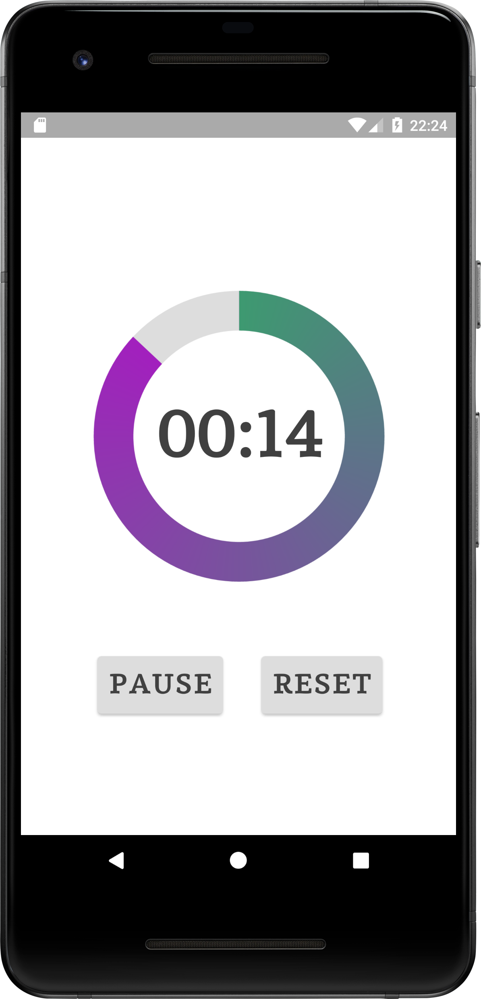
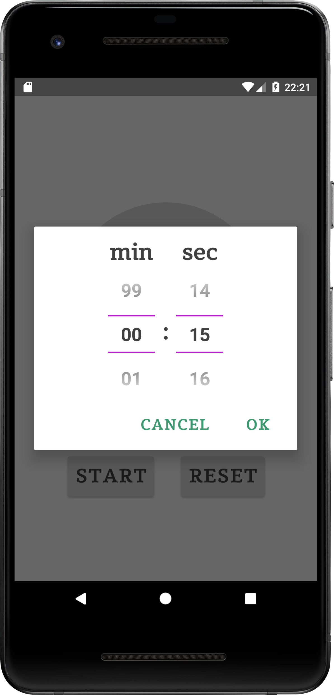

# CountDownTimer
CountDownTimer created in Android Studio

Press TextViewProgress in the center of the screen to invoke AlertDialog. Set minutes and seconds.

Press Button Start to make CountDownTimer and ProgressBar start action. Button Start becomes Button Pause.

Press Button Pause if you need to pause CountDownTimer and ProgressBar. Button Pause becomes Button Start. Press it to continue timer action.

Then timer is finished RingtoneManager will make sound.

Press Button Reset to stop sound or press Button Start to repeat timer action with the same minutes and seconds settings.

 
